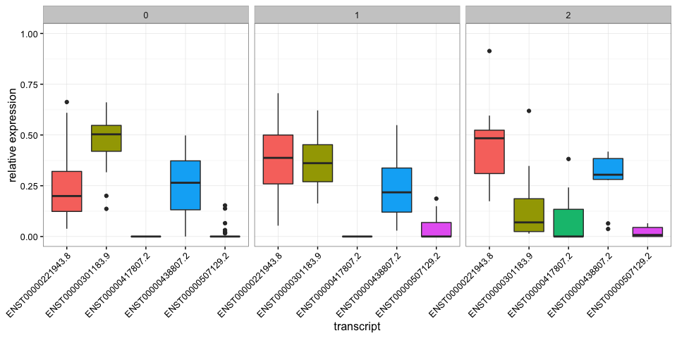
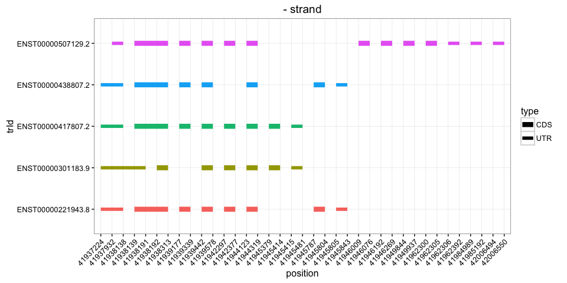

sQTLseekeR Overview
===================

``` r
library(sQTLseekeR)
```

Preparing the data
------------------

In the [Data](https://github.com/guigolab/sQTLseekeR/tree/master/Data) folder, you can find the transcript expressions for 5 genes and SNPs in these 5 regions. The genes coordinates are present in a third file.

``` r
trans.exp.f = "../Data/transExpression.tsv.gz"
gene.bed.f = "../Data/genes.bed"
genotype.f = "../Data/snps-012coded.tsv"
```

First, the **ordered** genotype file should be compressed and indexed (if not done externally before):

``` r
genotype.indexed.f = index.genotype(genotype.f)
```

Then the transcript expression should be imported, cleaned (removing genes with low expression, only one transcripts, etc). `prepare.trans.exp` returns relative transcript expressions.

``` r
te.df = read.table(trans.exp.f, as.is=TRUE, header=TRUE, sep="\t")
tre.df = prepare.trans.exp(te.df)
tre.df[1:5,1:5]
```

    ##                trId             geneId    NA06984   NA06985   NA06986
    ## 1 ENST00000537240.1  ENSG00000153162.7 0.43751596 0.0000000        NA
    ## 2 ENST00000283147.6  ENSG00000153162.7 0.56248404 1.0000000        NA
    ## 3 ENST00000540959.1  ENSG00000153162.7 0.00000000 0.0000000        NA
    ## 4 ENST00000221943.8 ENSG00000105341.11 0.09433891 0.5954386 0.1042922
    ## 5 ENST00000438807.2 ENSG00000105341.11 0.36197042 0.3900864 0.3787135

Test for gene/SNP associations
------------------------------

To run the tests, simply feed the transcript relative expression, genotype file path and the genes coordinates:

``` r
gene.bed = read.table(gene.bed.f, as.is=TRUE, sep="\t")
colnames(gene.bed) = c("chr","start","end","geneId")
res.df = sqtl.seeker(tre.df, genotype.indexed.f, gene.bed, svQTL=TRUE, verbose=FALSE)
head(res.df)
```

    ##               geneId                snpId         F nb.groups         md
    ## 1 ENSG00000105341.11      snp_19_41942273 0.7463264         2 0.06089571
    ## 2 ENSG00000105341.11 indel:1D_19_41950473 0.9920776         2 0.07977534
    ## 3 ENSG00000105341.11 indel:1I_19_41948106 0.4241252         2 0.05887422
    ## 4 ENSG00000105341.11      snp_19_41949474 1.2580514         2 0.08518506
    ## 5 ENSG00000105341.11      snp_19_41949794 0.9920776         2 0.07977534
    ## 6 ENSG00000105341.11      snp_19_41950266 0.3424375         2 0.01741091
    ##            tr.first         tr.second    F.svQTL nb.perms        pv
    ## 1 ENST00000301183.9 ENST00000438807.2 1.90043546    17577 0.5244055
    ## 2 ENST00000301183.9 ENST00000221943.8 0.57093122    17577 0.3900899
    ## 3 ENST00000301183.9 ENST00000221943.8 0.20409861    17577 0.7560018
    ## 4 ENST00000301183.9 ENST00000221943.8 0.05182114    17577 0.2786438
    ## 5 ENST00000301183.9 ENST00000221943.8 0.57093122    17577 0.3900899
    ## 6 ENST00000301183.9 ENST00000507129.2 6.40571245    17577 0.8194903
    ##   nb.perms.svQTL   pv.svQTL
    ## 1          10100 0.17414117
    ## 2          10100 0.45223245
    ## 3          10100 0.64815365
    ## 4          10100 0.81704782
    ## 5          10100 0.45223245
    ## 6          10100 0.01158301

The resulting data.frame shows information about the association between each SNP/gene.

In practice it's good to save these results before proceeding to sQTLs selection.

``` r
write.table(res.df, file="sQTLs-all.tsv", quote=FALSE, row.names=FALSE, sep="\t")
```

Finally, sQTLs are selected after multiple-testing correction with a user-defined FDR threshold.

``` r
sqtls.df = sqtls(res.df, FDR=.01, out.pdf="sQTLs-FDR01.pdf")
head(sqtls.df)
```

    ##               geneId           snpId        F nb.groups        md
    ## 1 ENSG00000105341.11 snp_19_41937095 9.886458         3 0.3273684
    ## 2 ENSG00000105341.11 snp_19_41946095 9.874434         3 0.3183545
    ## 3 ENSG00000105341.11 snp_19_41947242 6.548245         3 0.2751707
    ## 4  ENSG00000100376.7 snp_22_45731730 6.881392         2 0.1432240
    ## 5  ENSG00000100376.7 snp_22_45731731 6.881392         2 0.1432240
    ##            tr.first         tr.second  F.svQTL nb.perms           pv
    ## 1 ENST00000301183.9 ENST00000221943.8 6.131420  1000100 9.998990e-07
    ## 2 ENST00000301183.9 ENST00000221943.8 6.718939  1000100 9.998990e-07
    ## 3 ENST00000301183.9 ENST00000221943.8 5.206448  1000100 3.999596e-06
    ## 4 ENST00000216214.3 ENST00000487732.1 8.138808  1000100 9.998990e-07
    ## 5 ENST00000216214.3 ENST00000487732.1 8.138808  1000100 9.998990e-07
    ##   nb.perms.svQTL    pv.svQTL           qv   qv.svQTL
    ## 1          10100 0.003762004 1.751195e-05 0.01843568
    ## 2          10100 0.002772003 1.751195e-05 0.01441587
    ## 3          10100 0.006930007 6.855743e-05 0.02038756
    ## 4          10100 0.005742006 1.751195e-05 0.02038756
    ## 5          10100 0.005742006 1.751195e-05 0.02038756

Characterizing one sQTL
-----------------------

Let's say we want to visualize the effect of one of the detected sQTL. The first thing to look at is the relative expression of each transcript in the different genotype groups.

I also want to know the structure of each transcript so I load the CDS/UTR structure. This information was formatted from Genecode v12 annotation (see the [Splicing Event Classification tutorial](SplicingEventClassification.md) for more details).

``` r
load("../Data/transcriptStructureGencodeV12.RData")
sqtl.plot(sqtls.df$geneId[1], sqtls.df$snpId[1], tre.df, genotype.f, gene.bed, tr.str=trans.str)
```

    ## $relexpression



    ## 
    ## $structure



With these graphs, we see that it's mostly the first and second transcript whose usage changes, increasing and decreasing respectively. The relative expression of the other transcripts mostly stays the same across the different genotype groups.

The schematic structure of the transcripts show that these two transcripts differ quite a lot, and both at the beginning and end of the gene body.

R session
---------

``` r
sessionInfo()
```

    ## R version 3.2.3 (2015-12-10)
    ## Platform: x86_64-apple-darwin13.4.0 (64-bit)
    ## Running under: OS X 10.10.5 (Yosemite)
    ## 
    ## locale:
    ## [1] en_CA.UTF-8/en_CA.UTF-8/en_CA.UTF-8/C/en_CA.UTF-8/en_CA.UTF-8
    ## 
    ## attached base packages:
    ## [1] stats     graphics  grDevices utils     datasets  methods   base     
    ## 
    ## other attached packages:
    ## [1] sQTLseekeR_2.1  rmarkdown_0.9.6
    ## 
    ## loaded via a namespace (and not attached):
    ##  [1] Rcpp_0.12.7          formatR_1.4          futile.logger_1.4.1 
    ##  [4] GenomeInfoDb_1.6.1   plyr_1.8.4           XVector_0.10.0      
    ##  [7] bitops_1.0-6         futile.options_1.0.0 tools_3.2.3         
    ## [10] zlibbioc_1.16.0      digest_0.6.10        gtable_0.2.0        
    ## [13] tibble_1.2           evaluate_0.9         nlme_3.1-122        
    ## [16] lattice_0.20-33      mgcv_1.8-10          Matrix_1.2-3        
    ## [19] DBI_0.5-1            yaml_2.1.13          parallel_3.2.3      
    ## [22] stringr_1.1.0        dplyr_0.5.0          knitr_1.13.1        
    ## [25] cluster_2.0.3        Biostrings_2.38.3    S4Vectors_0.8.7     
    ## [28] IRanges_2.4.6        stats4_3.2.3         grid_3.2.3          
    ## [31] qvalue_2.2.2         data.table_1.9.6     R6_2.1.2            
    ## [34] BiocParallel_1.4.3   tidyr_0.6.0          reshape2_1.4.1      
    ## [37] ggplot2_2.1.0        lambda.r_1.1.7       magrittr_1.5        
    ## [40] splines_3.2.3        scales_0.4.0         Rsamtools_1.22.0    
    ## [43] htmltools_0.3.5      BiocGenerics_0.16.1  GenomicRanges_1.22.3
    ## [46] MASS_7.3-45          assertthat_0.1       colorspace_1.2-6    
    ## [49] permute_0.9-4        labeling_0.3         stringi_1.1.1       
    ## [52] munsell_0.4.3        lazyeval_0.2.0       chron_2.3-47        
    ## [55] vegan_2.4-1
